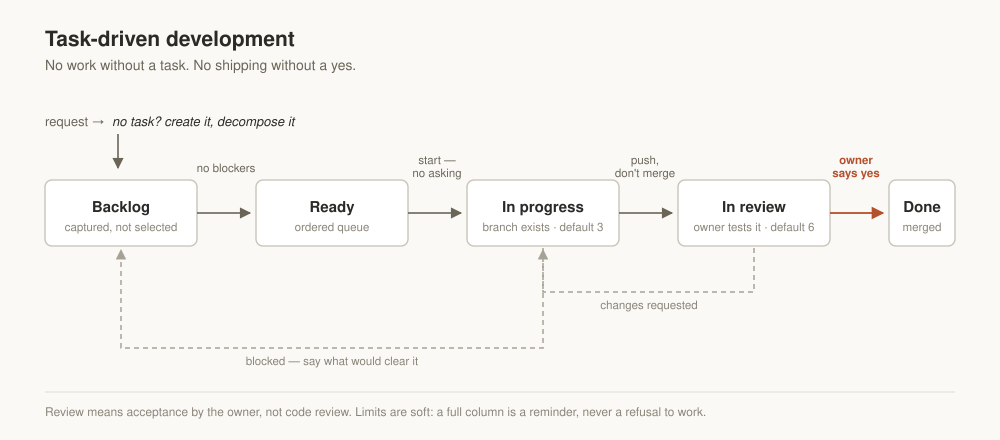

# Task-driven Claude skills

Three [Agent Skills](https://docs.claude.com/en/docs/agents-and-tools/agent-skills/overview)
that make Claude work the way a project manager would. Nothing gets built without a task on
the board, and nothing ships without the owner's yes.

They work with GitHub Projects, Jira, and Notion, and they carry no project-specific
configuration, so you install them once and use them across every repository you work in.



## The skills

| Skill | What it does | Triggers on |
|---|---|---|
| **task-driven-development** | Runs the daily cycle: find or create the task, decompose it, move it through the board, branch, push, hand off for acceptance, stop before shipping. | Any request to build, fix, or change something, and "what should I work on next?" |
| **project-bootstrap** | Sets up a new project: Kanban board with five columns, WIP limits, priority field, issue template, board identifiers recorded, first tasks seeded. | Starting a project, or a repository with no board yet. |
| **delivery-planning** | Turns the board into a timeline: sequences by dependency, finds the critical path, answers "when will this be done" with ranges. | Asking for a schedule, Gantt, milestones, or a delivery date. |

Install the first one on its own if you only want one. The other two build on the board it
assumes.

## What changes in practice

**A task exists before the code does.** If no task exists, Claude creates and decomposes
one before implementing anything. Untracked work stays invisible to everyone else, and
nobody can review it.

**Status moves without anyone asking you.** Starting work moves the card to In progress,
finishing it moves the card to In review. Both are bookkeeping. Asking every time trains you
to rubber-stamp.

**Review means accepting the work.** Claude writes the handoff as testing instructions:
where to look, what to click, what used to fail. It assumes you will never open the diff.

**Nothing merges or deploys without an explicit yes.** "The task looks done" is not
permission. But one yes covers the whole decision, so approving a merge already covers
closing the task and moving it to Done.

**Blocked work is surfaced early.** Asked what is next, Claude answers in three tiers: what
can be started, what is blocked and on whom, and what is deferred. Most blockers turn out to
be waiting on you, and hearing about them a week early is the whole reason for the second
tier.

## Installing

**Claude Code.** Clone into your skills directory:

```bash
git clone https://github.com/serge-it-max/project-management-skill.git ~/.claude/skills-src
ln -s ~/.claude/skills-src/skills/* ~/.claude/skills/
```

Or copy a single skill folder into `.claude/skills/` inside one project.

**Claude.ai.** Zip a skill folder and upload it in Settings → Capabilities → Skills.
Prebuilt `.skill` bundles are attached to each release.

## Adapting them to your project

The skills describe the shape of the cycle. Project-specific parameters go in your project's
`CLAUDE.md`, which takes precedence over the skills wherever the two disagree:

- Board and project identifiers, status field ID, option IDs
- Column names, if you renamed them
- WIP limits, and whether your tracker enforces them
- Branch naming and the production branch
- Where preview builds appear
- The checklist to run before calling something done
- A short pointer telling Claude to invoke `task-driven-development` before any change,
  before acting on a request that already names an issue by number, and before answering
  a question about board state
- A hook that blocks edits and shell commands until that skill has run once in the session

`project-bootstrap` writes both for you on a new project. They matter more than they
look: in a project with several other skills installed, a skill's one-line description
competes for the router's attention and can lose on casual requests, even ones that match
its own trigger examples almost exactly. `CLAUDE.md` loads in full on every session and
does not compete for anything, so the pointer engages the cycle far more often than the
description alone. It is still a bias: measured on a real project with the pointer already
in place, the skill fired in only about seven sessions out of ten.
The hook is what closes the rest of that gap, by refusing to let anything touch the
project until the skill has run in the session. If you already bootstrapped a project before
this was added, copy the `CLAUDE.md` paragraph by hand and merge the hook block from
`project-bootstrap`'s own instructions into your project's `.claude/settings.json`.

Keep board identifiers in your project file, never in a skill. You will share and publish
skills; the identifiers belong to one board.

## Design notes

A few decisions here are deliberate, in case you are tempted to change them.

**Backlog and Ready are separate columns.** "Everything we might do" and "what can be
started now" are different questions, and merging them is what makes a board stop being
useful past about twenty tasks.

**Ready is an ordered queue.** Membership means a task can be started, with no blockers.
Position means when. Priority shows up in the ordering; a task's column only marks whether
it can start.

**Five columns is a floor.** Every extra column adds a decision on every task. Add a sixth
only when you can name something the board cannot show you today.

**WIP limits are soft.** The defaults are 3 in progress and 6 in review, the second because
every task waiting in review is a branch that keeps diverging. When a limit is hit, Claude
mentions it once and carries on. It never refuses to work, and it never raises the limit on
its own.

## Compatibility

Written against the Agent Skills format used by Claude Code, the Claude apps, and the API.
Trackers supported: GitHub Projects (v2), Jira, and Notion. Adding another tracker means
writing one file under `references/`.

## License

MIT, see [LICENSE](LICENSE).

## Author

Built by [SergeIT](https://sergeit.it/) from a working project-management practice, and
refined against real projects.

Issues and pull requests are welcome, particularly for trackers not covered here.
